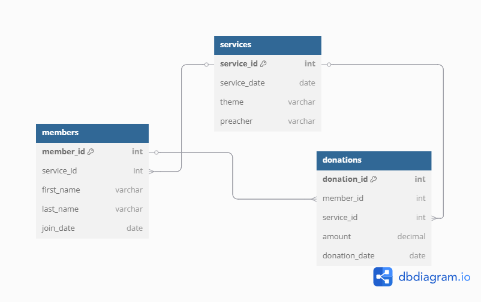

# WEEK 8 DATABASE ASSIGNMENT

This repository contains two database management systems: **Bank Database** and **Church Database**, along with their respective SQL scripts, ERD diagrams, and a Node.js application for managing the Church database.
## Screenshots

### Bank Database ERD


### Church Database ERD


## Folder Structure

```
Bankdb.sql         - SQL script for creating and populating the Bank database.
BankERD.png        - Entity Relationship Diagram (ERD) for the Bank database.
church.js          - Placeholder file for additional Church database functionality.
Churchdb.png       - Entity Relationship Diagram (ERD) for the Church database.
Churchdb.sql       - SQL script for creating and populating the Church database.
index.js           - Node.js application for managing the Church database (CRUD operations).
package.json       - Project dependencies and scripts.
README.md          - Documentation for the project.
```

## Features

### Bank Database
- **SQL Script**: [Bankdb.sql](Bankdb.sql)
  - Creates tables for customers, accounts, payment methods, transaction fees, and transactions.
  - Populates the database with sample data.
- **ERD**: [BankERD.png](BankERD.png)

### Church Database
- **SQL Script**: [Churchdb.sql](Churchdb.sql)
  - Creates tables for services, members, and donations.
  - Populates the database with sample data.
- **ERD**: [Churchdb.png](Churchdb.png)
- **Node.js Application**: [index.js](index.js)
  - Provides RESTful API endpoints for managing services, members, and donations.

## Installation

Follow these steps to set up the project on your local machine:

### 1. Clone the Repository
```bash
git clone https://github.com/BlessedConso001/WEEK-8-DATABASE-ASSIGNMENT.git
cd WEEK-8-DATABASE-ASSIGNMENT
```

### 2. Install Dependencies
Ensure you have Node.js installed. Then, run:
```bash
npm install
```

### 3. Set Up the Database
- Import the SQL scripts into your MySQL database:
  - For the Bank database: Import `Bankdb.sql`.
  - For the Church database: Import `Churchdb.sql`.
- Update the `.env` file with your database credentials (create the file if it doesn't exist):
  ```
  DB_HOST=localhost
  DB_USER=root
  DB_PASSWORD=yourpassword
  DB_NAME=church_db
  PORT=3000
  ```

### 4. Run the Application
Start the Node.js server:
```bash
npm start
```
The server will run on `http://localhost:3000`.

## API Endpoints

The Node.js application provides the following endpoints for managing the Church database:

### Members
- **Create**: `POST /members`
- **Read All**: `GET /members`
- **Read One**: `GET /members/:id`
- **Update**: `PUT /members/:id`
- **Delete**: `DELETE /members/:id`

### Services
- **Create**: `POST /services`
- **Read All**: `GET /services`
- **Read One**: `GET /services/:id`
- **Update**: `PUT /services/:id`
- **Delete**: `DELETE /services/:id`

### Donations
- **Create**: `POST /donations`
- **Read All**: `GET /donations`
- **Read One**: `GET /donations/:id`
- **Update**: `PUT /donations/:id`
- **Delete**: `DELETE /donations/:id`


## License
This project is licensed under the ISC License.

## Author
BlessedConso001
```

